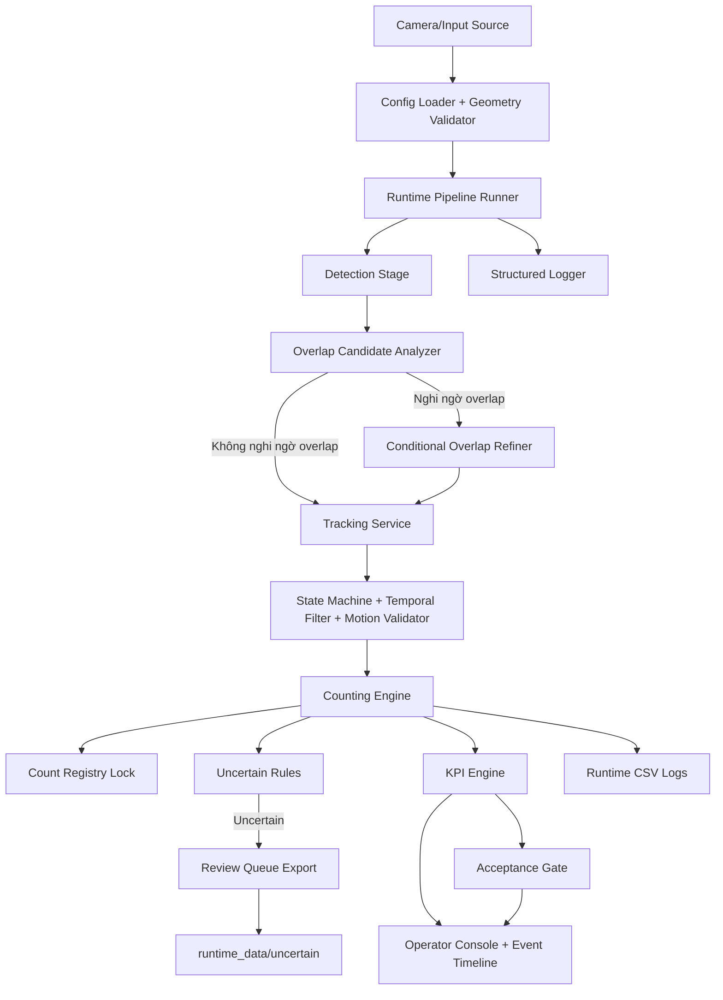
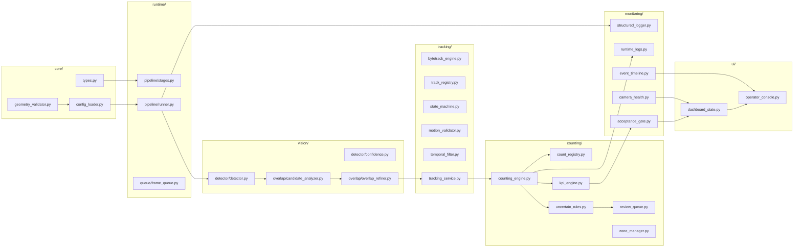
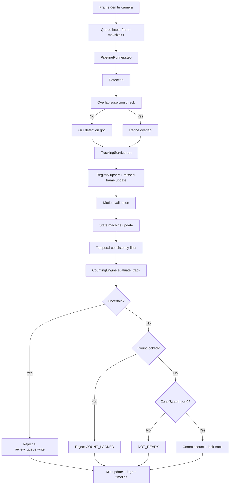
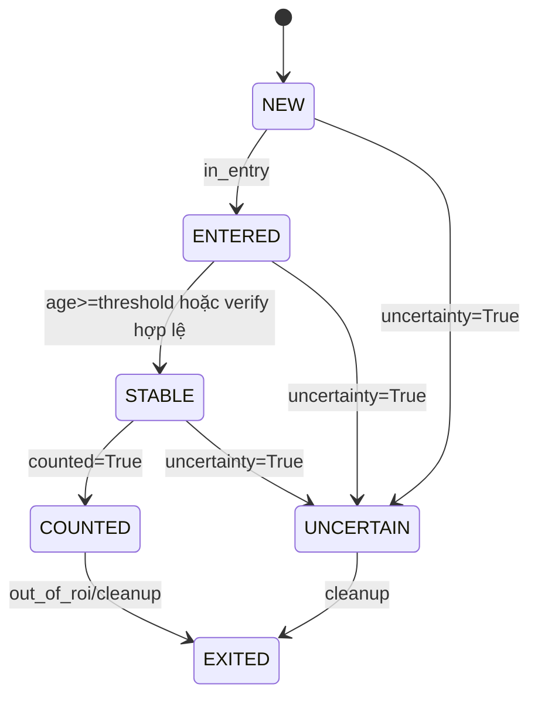
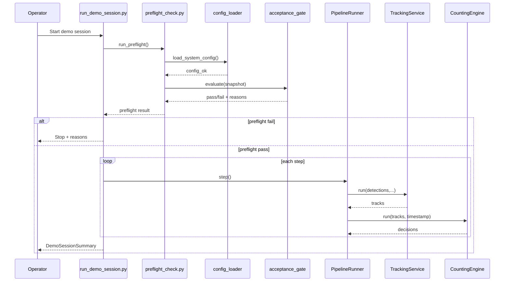
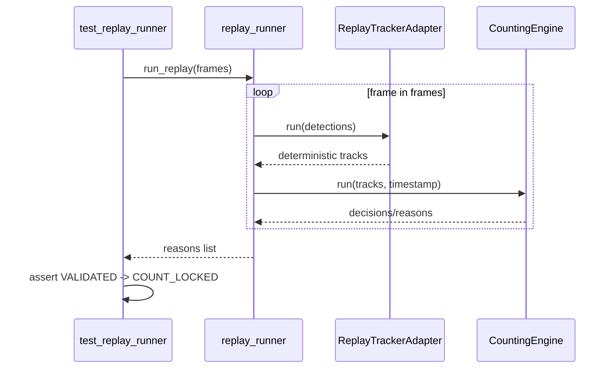
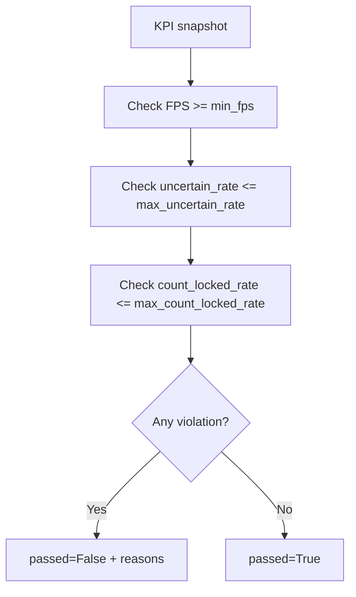
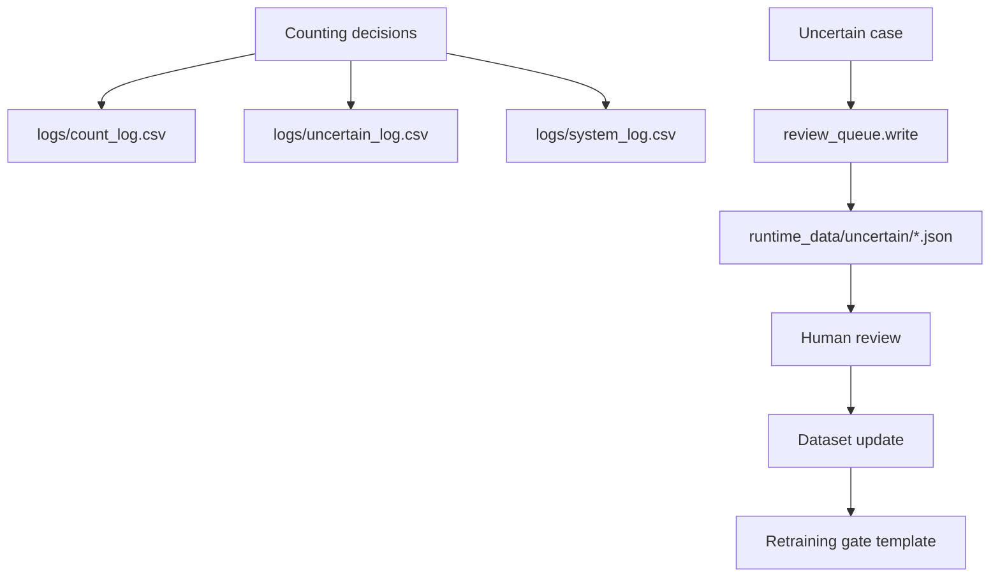
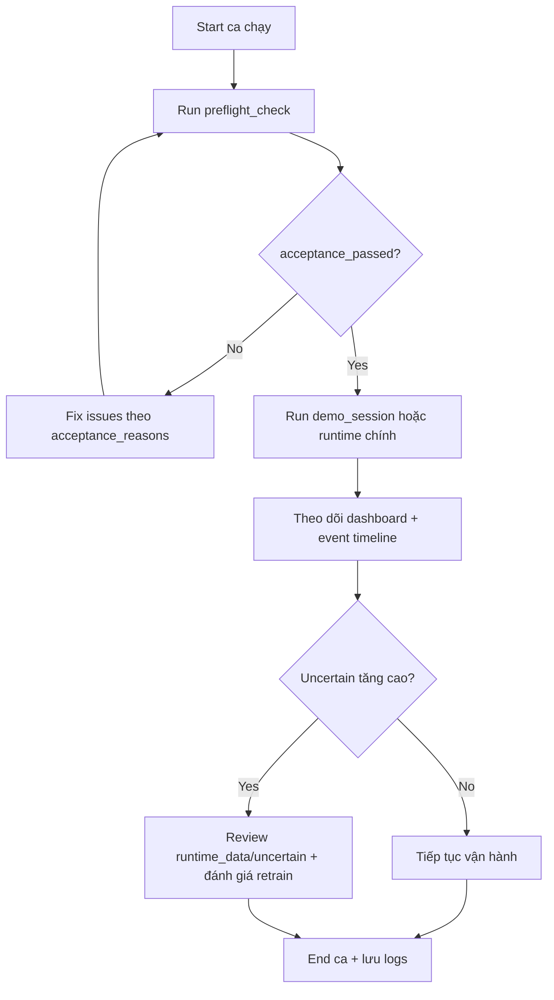

# FLOWCHART — Kiến trúc & Luồng xử lý hệ thống (Mermaid)

Tài liệu này tổng hợp đầy đủ các sơ đồ kỹ thuật quan trọng nhất của hệ thống PoC đếm vật thể băng tải.

---

## 1) Kiến trúc tổng thể hệ thống (Logical Architecture)



---

## 2) Kiến trúc module theo package



---

## 3) Luồng end-to-end runtime (mỗi frame)



---

## 4) Luồng thuật toán CountingEngine (chi tiết quyết định)

```mermaid
flowchart TD
    A[Input: TrackState + timestamp] --> B[Evaluate uncertain_rules]
    B --> C{uncertain?}
    C -->|Yes| D[Write review sample]
    D --> E[Return CountDecision=False + reason]

    C -->|No| F{track_id đã locked?}
    F -->|Yes| G[Return COUNT_LOCKED]

    F -->|No| H{state in STABLE/COUNTED?}
    H -->|No| I[Return NOT_READY]

    H -->|Yes| J{zone_history có ENTERED + VERIFY?}
    J -->|No| I
    J -->|Yes| K[registry.lock(track_id)]
    K --> L[total_count += 1]
    L --> M[Return VALIDATED]
```

---

## 5) State machine vòng đời track



---

## 6) Sequence diagram — preflight + demo session runner



---

## 7) Sequence diagram — replay regression



---

## 8) Luồng Acceptance Gate (go/no-go)



---

## 9) Luồng Event Timeline cho operator

```mermaid
flowchart LR
    A[Runtime event] --> B[event_timeline.add]
    B --> C[deque max_events]
    C --> D[latest(n)]
    D --> E[OperatorConsole.render_text]
```

---

## 10) Luồng dữ liệu vận hành và hậu kiểm



---

## 11) Sơ đồ cây vận hành nhanh cho operator



---

## 12) Ghi chú kỹ thuật quan trọng

- Các sơ đồ phản ánh **trạng thái code hiện tại** trong repo.
- Đây là baseline PoC; các node production-level (tracker backend thật, UI PyQt đầy đủ, GT evaluator đầy đủ) là bước tiếp theo.
- Nguyên tắc bất biến: **Không chắc chắn thì không đếm**.